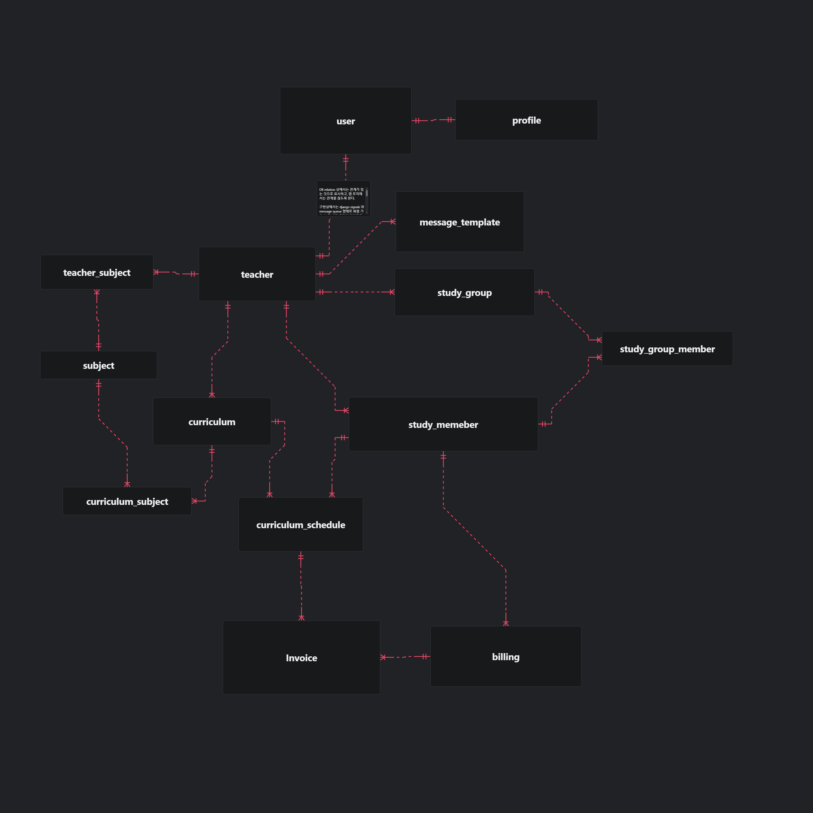

# 모델링

## ERD

## 테이블 설명

- user: 사용자
- profile: 사용자 프로필
    - 추후에 사용자의 부가 정보를 받을 수 있으므로, profile 테이블을 생성한다. 
- teacher: 선생님
    - 왜 User 모델과 분리 시켰는가?
        - 해당 웹앱의 목적상 가입할 때의 `role`에 따라 얽혀있는 데이터베이스 모델들이 많다.
        - 이는 가입자가 많아지면 많아질수록 확장성과 성능의 문제가 발생할 수 있을거라 생각했다.
        - 따라서 `User` 모델과 `Teacher` 모델을 분리하여 `role`에 따라 다른 데이터베이스 모델을 사용하도록 했다.
- subject: 과목
- teacher_subject: 선생님이 가르치는 과목
- curriculum: 수업 커리큘럼
- curriculum_subject: 수업 커리큘럼의 과목 
- curriculum_schedule: 수업 일정
- study_member: 수업을 받고있는 학생
    - 수업을 받는 학생들은 해당 웹 사이트에 가입하지 않았기 때문에 선생님이 임의로 넣을 수 있도록 한다.
    - 단 추후 학생들이 해당 사이트에 가입하게 된다면 수업 정보나 선생님이 한 피드백 등의 열람을 선생님에게 요청하는 방식으로 데이터 이전 하는 것도 생각할 수 있다.
- study_group: 수업 그룹
- study_group_member: 수업 그룹의 멤버 
- billing: 청구 대상
    - 청구서를 받을 대상을 나태낸다.
- invoice: 청구서
    - 수업 일정에 따른 청구서를 생성한다.
- message_template: 메시지 템플릿
    - 선생님이 보낼 메시지의 템플릿을 저장한다.

## apps

### 사용자(account)

- user
- profile
- teacher
- subject
- teacher_subject
- message_template

### 학생 관리(student_management)

- study_member
- study_group
- study_group_member

### 수업(lesson)

- curriculum
- curriculum_subject
- curriculum_schedule

### 청구(charge)

- invoice
- billing