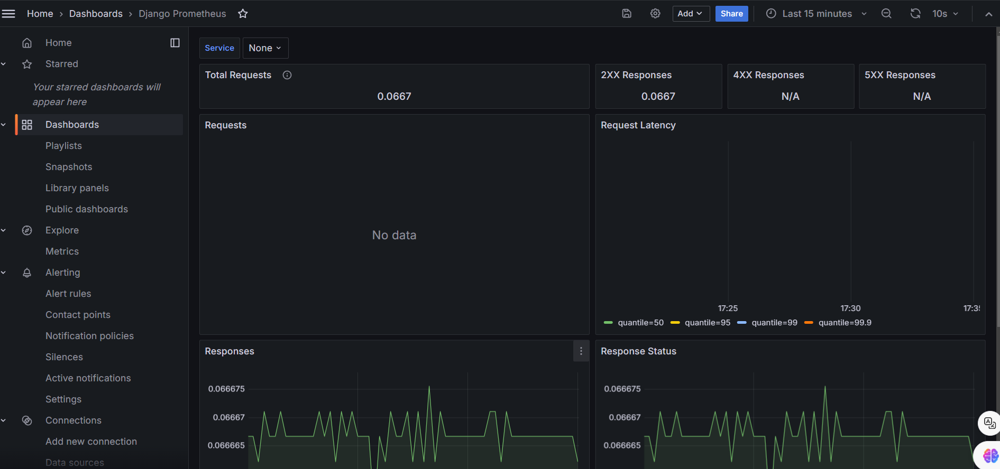
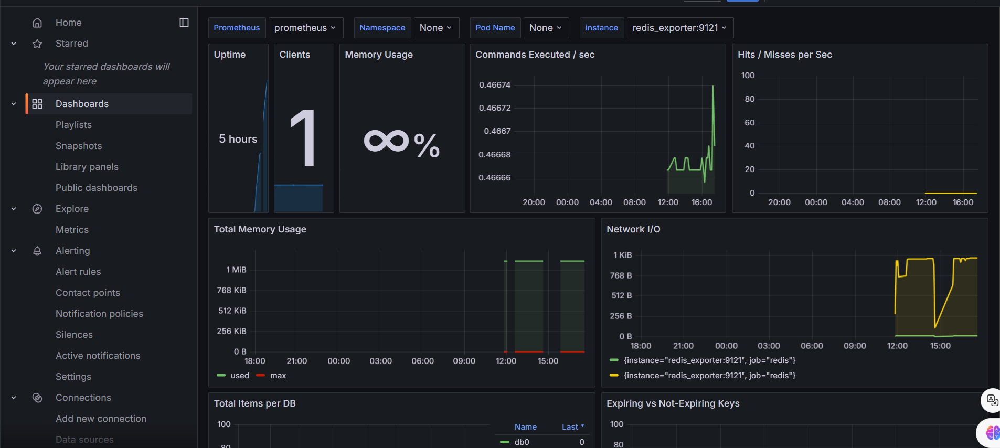

# 모니터링 설치 도전

## docker-compose로 모니터링 띄우기

- grafana + prometheus + node-exporter
- [참고문서](https://www.devkuma.com/docs/prometheus/docker-compose-install/)
- `django-prometheus`를 통한 django 모니터링
    - [참고문서](https://karanchuri.medium.com/prometheus-grafana-in-django-92da4d782f8a)
    - [django-prometheus](https://github.com/korfuri/django-prometheus)

## Alert

- [참고문서](https://velog.io/@su_under/Grafana%EC%99%80-Slack-%EC%97%B0%EB%8F%99%ED%95%98%EC%97%AC-Alert-%EC%84%A4%EC%A0%95%ED%95%98%EA%B8%B0)

## 구축 모습

### Django

### Redis

## 고민할 부분

1. metrics 수집 보안은 어떻게 할 것인가?
  - 현재는 load balancer 의 경로를 편집해서 metrics를 수집하는 서버만 접근 가능하도록 하는 방법이 나을 듯 싶다.